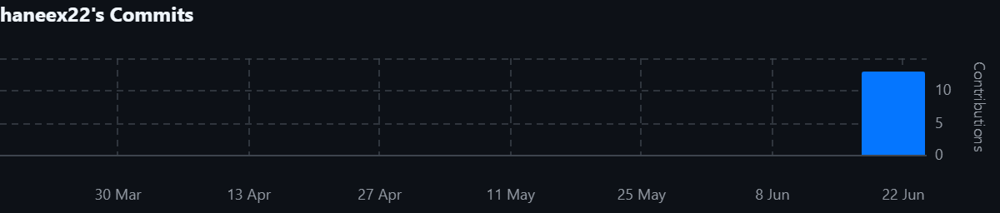

# Информационная система проката автомобилей

Мобильное приложение для автоматизации процессов аренды автомобилей.
Траектория В (Мобильная разработка), СКФУ, 2026.

## Стек технологий
- Backend: Java 17 + Spring Boot 3 + PostgreSQL 15
- Mobile: Android (Kotlin + Jetpack Compose)
- Архитектура: PCMEF (адаптированная для мобильной траектории)

## Быстрый старт
```bash
git clone <repo>
docker-compose up -d
```

Бэкенд доступен на `http://localhost:8080`.
Тестовые учётные записи: `admin@carrent.ru`, `client@carrent.ru` — пароль `password123`.

## Статистика разработки
### Метрики Git
- Всего коммитов: —
- Период: —

### График активности

