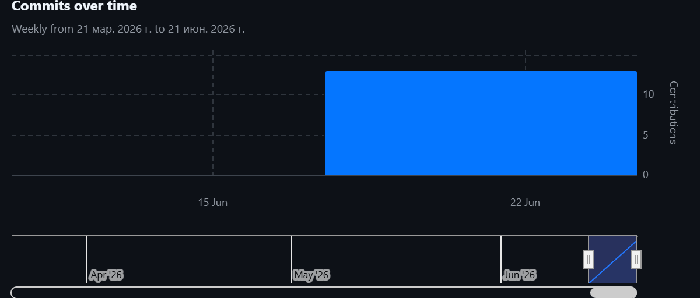

# Информационная система проката автомобилей 🚗

[](https://adoptium.net/)
[](https://kotlinlang.org/)
[](https://spring.io/projects/spring-boot)
[](LICENSE)
[](https://github.com/haneex22/3course-project/actions)

Мобильное приложение для автоматизации процессов аренды автомобилей.
Траектория В (Мобильная разработка), СКФУ, 2026.

## Стек технологий
| Компонент | Технология |
|-----------|------------|
| Backend | Java 17 + Spring Boot 3.2 + Spring Security |
| Database | PostgreSQL 16 + Flyway |
| ORM | Spring Data JPA / Hibernate |
| API | REST + OpenAPI/Swagger |
| Auth | JWT + BCrypt |
| Mobile | Android (Kotlin + Jetpack Compose + Material 3) |
| Network | Retrofit 2 + OkHttp + Coil |
| Local DB | Room (офлайн-кэш) |
| Архитектура | PCMEF (Presentation → Control → Mediator → Entity → Foundation) |
| Инфраструктура | Docker + Docker Compose |

## Структура проекта
```
📦 CarRentalApp
├── 📱 app/              # Android-клиент
│   ├── apiclient/       # Retrofit, API-интерфейсы, JWT-интерцептор
│   ├── localcache/      # Room (AppDatabase, DAO, TokenStorage)
│   ├── model/           # DTO для запросов/ответов
│   ├── presentation/    # Экраны (Compose) + Navigation
│   │   ├── admin/       # Панель управления автопарком
│   │   ├── auth/        # Логин и регистрация
│   │   ├── booking/     # Бронирование автомобиля
│   │   ├── catalog/     # Каталог + детали авто
│   │   ├── common/      # CarLabels, RentGoLogo
│   │   └── profile/     # Профиль и бронирования
│   ├── statemanagement/ # ViewModel + StateFlow
│   └── ui/theme/        # Material 3 тема (светлая/тёмная)
│
├── 🖥️ backend/          # Java Spring Boot сервер
│   └── src/main/java/ru/skfu/carrental/
│       ├── control/     # REST-контроллеры
│       ├── mediator/    # Сервисы + Facade + Стратегии
│       ├── entity/      # JPA-сущности + State-паттерн
│       ├── foundation/  # JPA-репозитории
│       ├── security/    # JWT, SecurityConfig
│       ├── exception/   # GlobalExceptionHandler
│       └── scheduler/   # Планировщик отмены броней
│
├── 📂 .github/workflows/  # GitHub Actions CI/CD
├── 📚 docs/             # Документация проекта
│   ├── 01-business-model/   # IDEF0, BUC, Глоссарий, SWOT, ROI
│   ├── 02-requirements/     # Use Case, Domain Model, Спецификации
│   ├── 03-architecture/     # PCMEF, Интерфейсы, ADR
│   ├── 04-database/         # ER, DDL
│   ├── 05-design/           # Sequence-диаграммы
│   └── images/              # Рендереные диаграммы
├── 📄 docs/presentation.md  # Презентация к защите
├── 🐳 docker-compose.yml
├── 📄 LICENSE
└── 📖 README.md
```

## Быстрый старт 🚀

### Запуск бэкенда (Docker)
```bash
docker-compose up -d
```

### Запуск Android-приложения
1. Откройте папку `app/` в Android Studio
2. Запустите эмулятор Android
3. Приложение автоматически подключится к `http://10.0.2.2:8080`

### Доступные эндпоинты
- Swagger UI: http://localhost:8080/swagger-ui.html
- OpenAPI JSON: http://localhost:8080/v3/api-docs

### Тестовые учётные записи
| Роль | Email | Пароль |
|------|-------|--------|
| Администратор | `admin@carrent.ru` | `password123` |
| Менеджер | `manager@carrent.ru` | `password123` |
| Клиент | `client@carrent.ru` | `password123` |

## Git-статистика 📊

- 👨‍💻 Разработчик: Джабраилов (1 контрибьютор)
- 📅 Период: 2026 г.
- 📝 Коммитов: 12

> **📸 Скриншоты GitHub
> 
> 

---

## Архитектура (PCMEF) 🏗️


Проект использует архитектурный паттерн PCMEF:
- **Presentation** — экраны Android (Jetpack Compose)
- **Control** — REST-контроллеры (Spring MVC)
- **Mediator** — бизнес-логика (Services + Facade + Strategy)
- **Entity** — доменные сущности (JPA + State pattern)
- **Foundation** — доступ к данным (JPA Repositories + Room)

## API Endpoints

### Auth (публичные)
| Метод | Path | Описание |
|-------|------|----------|
| POST | `/api/v1/auth/login` | Аутентификация |
| POST | `/api/v1/auth/register` | Регистрация |

### Cars (требуют JWT)
| Метод | Path | Роль | Описание |
|-------|------|------|----------|
| GET | `/api/v1/cars` | Любая | Каталог с фильтрами |
| GET | `/api/v1/cars/{id}` | Любая | Детали авто |
| GET | `/api/v1/cars/{id}/busy` | Любая | Занятые даты |
| PUT | `/api/v1/cars/{id}/status` | MANAGER/ADMIN | Смена статуса |

### Bookings (требуют роль CLIENT)
| Метод | Path | Описание |
|-------|------|----------|
| POST | `/api/v1/bookings` | Создать бронирование |
| GET | `/api/v1/bookings/my` | Мои бронирования |
| GET | `/api/v1/bookings/{id}` | Детали брони |
| POST | `/api/v1/bookings/{id}/cancel` | Отменить бронь |

### Admin (требуют роль ADMIN/MANAGER)
| Метод | Path | Роль | Описание |
|-------|------|------|----------|
| GET | `/api/v1/admin/cars` | MANAGER/ADMIN | Весь автопарк |
| POST | `/api/v1/admin/cars` | ADMIN | Добавить авто |
| PUT | `/api/v1/admin/cars/{id}` | ADMIN | Редактировать авто |
| DELETE | `/api/v1/admin/cars/{id}` | ADMIN | Удалить авто |
| GET | `/api/v1/admin/bookings` | MANAGER/ADMIN | Все бронирования |
| GET | `/api/v1/admin/bookings/{id}` | MANAGER/ADMIN | Детали брони |
| POST | `/api/v1/admin/bookings/{id}/cancel` | ADMIN | Отменить бронь |
| POST | `/api/v1/admin/bookings/{id}/handover` | MANAGER | Выдать авто (UC-007) |
| POST | `/api/v1/admin/bookings/{id}/return` | MANAGER | Принять возврат (UC-008) |
| GET | `/api/v1/admin/clients/unverified` | MANAGER/ADMIN | Неверифиц. клиенты |
| PUT | `/api/v1/admin/clients/{userId}/verify` | ADMIN | Верифицировать клиента |

## Документация 📚

| Раздел | Файл | Описание |
|--------|------|----------|
| Бизнес-модель | [buc-diagram.md](docs/01-business-model/buc-diagram.md) | BUC-диаграмма |
| | [context-diagram.md](docs/01-business-model/context-diagram.md) | IDEF0 контекстная диаграмма |
| | [glossary.md](docs/01-business-model/glossary.md) | Глоссарий (16 терминов) |
| | [swot.md](docs/01-business-model/swot.md) | SWOT-анализ |
| | [roi.md](docs/01-business-model/roi.md) | Экономическая эффективность |
| Требования | [use-case-diagram.md](docs/02-requirements/use-case-diagram.md) | Use Case диаграмма |
| | [domain-model.md](docs/02-requirements/domain-model.md) | Доменная модель |
| | [use-case-specifications.md](docs/02-requirements/use-case-specifications.md) | Спецификации UC |
| Архитектура | [pcmef-diagram.md](docs/03-architecture/pcmef-diagram.md) | PCMEF архитектура |
| | [interfaces.md](docs/03-architecture/interfaces.md) | Интерфейсы слоёв |
| | [adr.md](docs/03-architecture/adr.md) | Architectural Decision Records |
| БД | [er-diagram.md](docs/04-database/er-diagram.md) | ER-диаграмма |
| | [ddl.sql](docs/04-database/ddl.sql) | DDL-скрипт PostgreSQL |
| Проектирование | [sequence-diagrams.md](docs/05-design/sequence-diagrams.md) | Sequence-диаграммы (5 UC) |
| | [executive-summary.md](docs/05-design/executive-summary.md) | Executive Summary |
| Защита | [presentation.md](docs/presentation.md) | План презентации |

## Реализованные паттерны GoF
- **State** — жизненный цикл бронирования (Pending → Confirmed → Active → Cancelled)
- **Strategy** — ценообразование (StandardPricing / WeekendPricing)
- **Facade** — BookingFacade для сложного процесса бронирования
- **Singleton** — ApiClient, AppDatabase

## Функциональные возможности
- ✅ JWT-аутентификация (BCrypt, роли CLIENT/MANAGER/ADMIN)
- ✅ Каталог автомобилей с фильтрацией по классу и датам
- ✅ Поиск по модели, сортировка по цене
- ✅ Бронирование с проверкой доступности
- ✅ State-паттерн для жизненного цикла бронирования
- ✅ Панель управления автопарком (ADMIN/MANAGER)
- ✅ Офлайн-режим (Room-кэш каталога и бронирований)
- ✅ Pull-to-refresh на всех экранах
- ✅ Docker-контейнеризация
- ✅ Material 3 Design (светлая/тёмная тема)
- ✅ EncryptedSharedPreferences для JWT
- ✅ Swagger UI с JWT Bearer авторизацией
- ✅ GitHub Actions CI/CD
- ✅ Покрытие тестами >40% (12 классов backend + Android)
- ✅ Выдача и приём автомобилей (UC-007, UC-008)
- ✅ Обработка ошибок с понятными сообщениями на русском

## Оценка по COCOMO
| Параметр | Значение |
|----------|:--------:|
| Размер кода | ~9 000 LOC |
| Трудоёмкость | 9.1 человеко-месяца |
| Время разработки | ~6 месяцев |
| Средний размер команды | 2-3 разработчика |
| Тип проекта | Органический |

## Структура работ (WBS)
Проект включает 6 основных блоков работ:
1. Управление проектом и документация
2. Анализ и проектирование (архитектура, БД, API)
3. Разработка серверной части (Spring Boot)
4. Разработка клиентской части (Android)
5. Интеграция и развертывание (Docker, CI/CD)
6. Тестирование (JUnit, Mockito)

## Лицензия
Проект распространяется под лицензией [MIT](LICENSE). Учебный проект, СКФУ, 2026.
