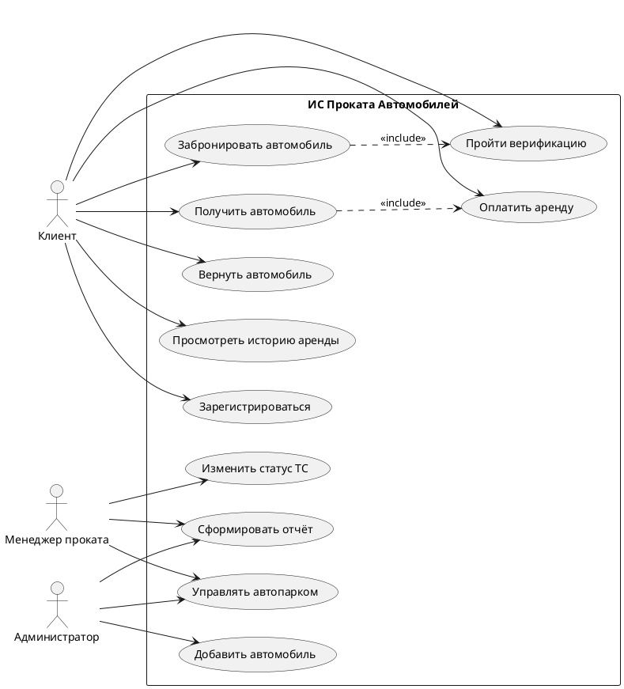

# **Модель бизнес-классов (Business Class Model)**

```
[Модель бизнес-классов (Business Class Model)](../images/diagram_Business_Class_Model_1.png)
```

*Исходный код диаграммы:*


```plantuml
@startuml BUC_CarRental
left to right direction

actor "Клиент" as Client
actor "Менеджер проката" as Manager
actor "Администратор" as Admin

rectangle "ИС Проката Автомобилей" {
  usecase "Зарегистрироваться" as UC_R
  usecase "Пройти верификацию" as UC_V
  usecase "Забронировать автомобиль" as UC_B
  usecase "Оплатить аренду" as UC_P
  usecase "Получить автомобиль" as UC_G
  usecase "Вернуть автомобиль" as UC_Ret
  usecase "Просмотреть историю аренды" as UC_H
  usecase "Управлять автопарком" as UC_M
  usecase "Изменить статус ТС" as UC_S
  usecase "Добавить автомобиль" as UC_A
  usecase "Сформировать отчёт" as UC_Rep
}

Client --> UC_R
Client --> UC_V
Client --> UC_B
Client --> UC_P
Client --> UC_G
Client --> UC_Ret
Client --> UC_H

Manager --> UC_M
Manager --> UC_S
Manager --> UC_Rep

Admin --> UC_A
Admin --> UC_M
Admin --> UC_Rep

UC_B ..> UC_V : <<include>>
UC_G ..> UC_P : <<include>>
@enduml
```

