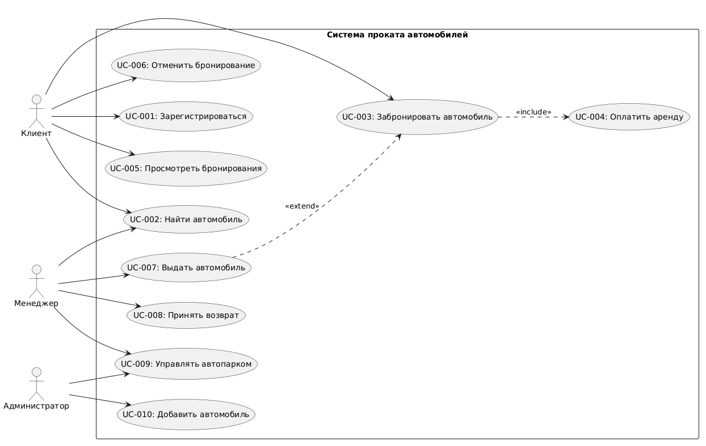
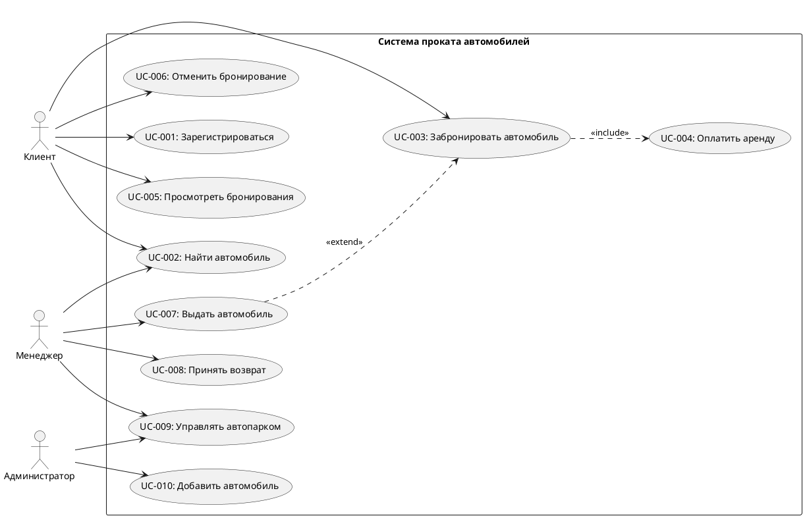

# Диаграмма вариантов использования

*Исходный код диаграммы:*

```plantuml
@startuml UC_CarRental
left to right direction
skinparam packageStyle rectangle

actor "Клиент" as Client
actor "Менеджер" as Manager
actor "Администратор" as Admin

rectangle "Система проката автомобилей" {
  usecase "UC-001: Зарегистрироваться" as UC1
  usecase "UC-002: Найти автомобиль" as UC2
  usecase "UC-003: Забронировать автомобиль" as UC3
  usecase "UC-004: Оплатить аренду" as UC4
  usecase "UC-005: Просмотреть бронирования" as UC5
  usecase "UC-006: Отменить бронирование" as UC6
  usecase "UC-007: Выдать автомобиль" as UC7
  usecase "UC-008: Принять возврат" as UC8
  usecase "UC-009: Управлять автопарком" as UC9
  usecase "UC-010: Добавить автомобиль" as UC10
}

Client --> UC1
Client --> UC2
Client --> UC3
Client --> UC5
Client --> UC6
Manager --> UC2
Manager --> UC7
Manager --> UC8
Manager --> UC9
Admin --> UC9
Admin --> UC10

UC3 ..> UC4 : <<include>>
UC7 ..> UC3 : <<extend>>
@enduml
```
