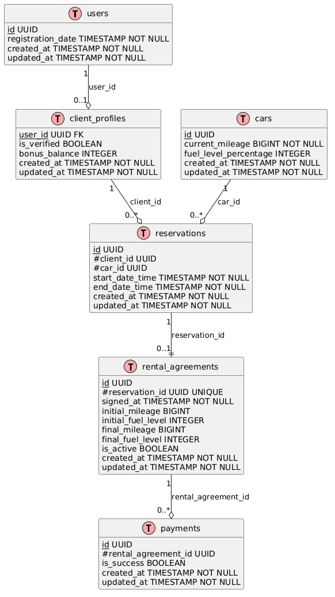
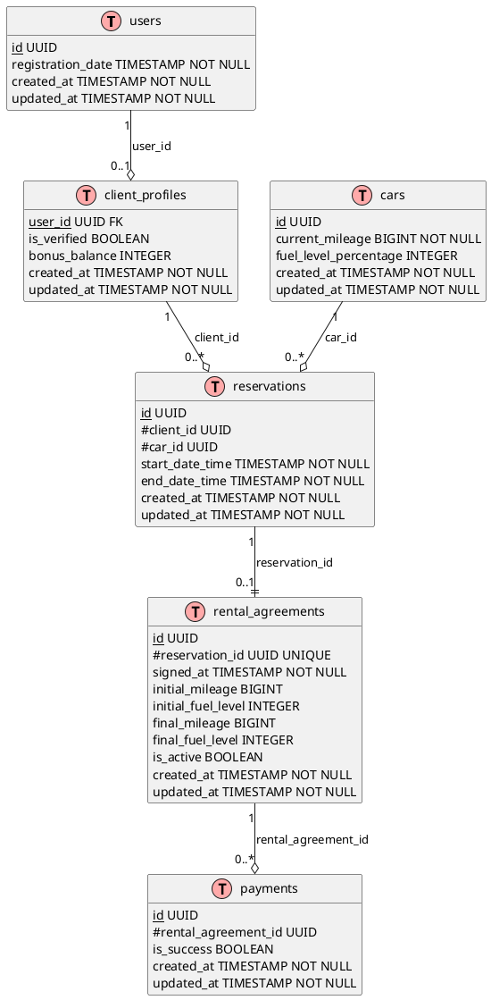

# ER-диаграмма

*Исходный код диаграммы:*

```plantuml
@startuml ER_Diagram
!define TABLE(name,desc) class name as "desc" << (T,#FFAAAA) >>
!define PK(x) <u>x</u>
!define FK(x) #x

skinparam classAttributeIconSize 0
hide methods

TABLE(users, "users") {
  PK(id) UUID
  email VARCHAR(255) UNIQUE NOT NULL
  password_hash VARCHAR(60) NOT NULL
  role VARCHAR(20) NOT NULL
  registration_date TIMESTAMP NOT NULL
  created_at TIMESTAMP NOT NULL
  updated_at TIMESTAMP NOT NULL
}

TABLE(client_profiles, "client_profiles") {
  PK(user_id) UUID FK
  is_verified BOOLEAN
  bonus_balance INTEGER
  passport_series VARCHAR(10)
  passport_number VARCHAR(20)
  license_number VARCHAR(50)
  created_at TIMESTAMP NOT NULL
  updated_at TIMESTAMP NOT NULL
}

TABLE(cars, "cars") {
  PK(id) UUID
  vin VARCHAR(17) UNIQUE NOT NULL
  license_plate VARCHAR(20) UNIQUE NOT NULL
  model_name VARCHAR(100) NOT NULL
  current_mileage BIGINT NOT NULL
  fuel_level_percentage INTEGER
  car_class VARCHAR(50) NOT NULL
  base_daily_rate DECIMAL(10,2) NOT NULL
  status VARCHAR(20) NOT NULL
  image_url VARCHAR(500)
  created_at TIMESTAMP NOT NULL
  updated_at TIMESTAMP NOT NULL
}

TABLE(reservations, "reservations") {
  PK(id) UUID
  FK(client_id) UUID
  FK(car_id) UUID
  start_date_time TIMESTAMP NOT NULL
  end_date_time TIMESTAMP NOT NULL
  status VARCHAR(20) NOT NULL
  amount DECIMAL(10,2) NOT NULL
  currency VARCHAR(3) NOT NULL
  created_at TIMESTAMP NOT NULL
  updated_at TIMESTAMP NOT NULL
}

TABLE(rental_agreements, "rental_agreements") {
  PK(id) UUID
  FK(reservation_id) UUID UNIQUE
  agreement_number VARCHAR(100) UNIQUE NOT NULL
  signed_at TIMESTAMP NOT NULL
  initial_mileage BIGINT
  initial_fuel_level INTEGER
  final_mileage BIGINT
  final_fuel_level INTEGER
  is_active BOOLEAN
  created_at TIMESTAMP NOT NULL
  updated_at TIMESTAMP NOT NULL
}

TABLE(payments, "payments") {
  PK(id) UUID
  FK(rental_agreement_id) UUID
  transaction_id VARCHAR(255) UNIQUE
  is_success BOOLEAN
  payment_type VARCHAR(50) NOT NULL
  amount DECIMAL(10,2) NOT NULL
  currency VARCHAR(3) NOT NULL
  created_at TIMESTAMP NOT NULL
  updated_at TIMESTAMP NOT NULL
}

users "1" --o "0..1" client_profiles : user_id
client_profiles "1" --o "0..*" reservations : client_id
cars "1" --o "0..*" reservations : car_id
reservations "1" --|| "0..1" rental_agreements : reservation_id
rental_agreements "1" --o "0..*" payments : rental_agreement_id
@enduml
```
