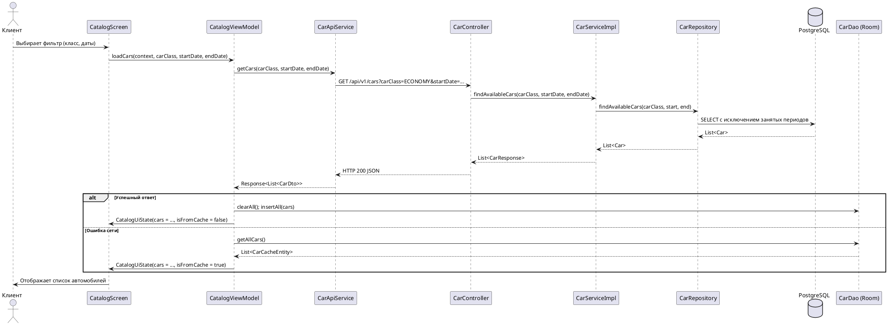
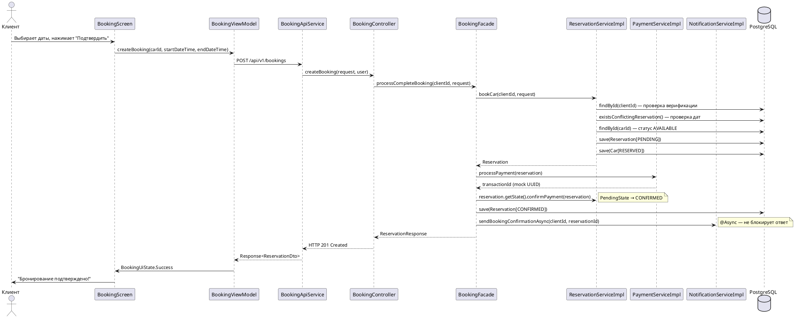
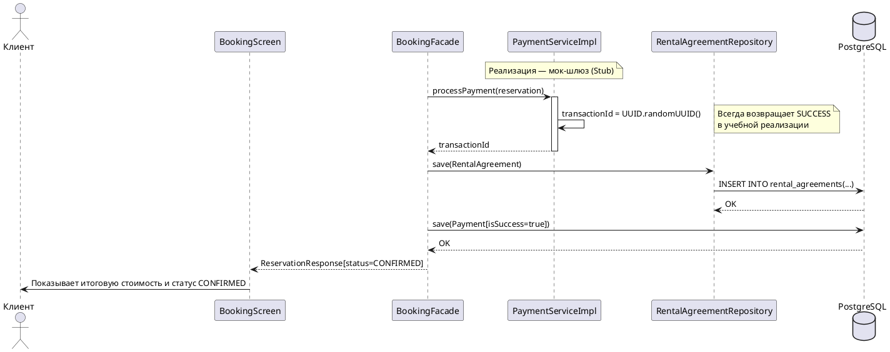

# Диаграммы последовательности

## UC-002: Найти автомобиль по фильтрам

```plantuml
@startuml UC002_SearchCar
actor "Клиент" as Client
participant "CatalogScreen" as UI
participant "CatalogViewModel" as VM
participant "CarApiService" as API
participant "CarController" as Ctrl
participant "CarServiceImpl" as Svc
participant "CarRepository" as Repo
database "PostgreSQL" as DB
participant "CarDao (Room)" as Cache

Client -> UI: Выбирает фильтр (класс, даты)
UI -> VM: loadCars(context, carClass, startDate, endDate)
VM -> API: getCars(carClass, startDate, endDate)
API -> Ctrl: GET /api/v1/cars?carClass=ECONOMY&startDate=...
Ctrl -> Svc: findAvailableCars(carClass, startDate, endDate)
Svc -> Repo: findAvailableCars(carClass, start, end)
Repo -> DB: SELECT с исключением занятых периодов
DB --> Repo: List<Car>
Repo --> Svc: List<Car>
Svc --> Ctrl: List<CarResponse>
Ctrl --> API: HTTP 200 JSON
API --> VM: Response<List<CarDto>>

alt Успешный ответ
  VM -> Cache: clearAll(); insertAll(cars)
  VM -> UI: CatalogUiState(cars = ..., isFromCache = false)
else Ошибка сети
  VM -> Cache: getAllCars()
  Cache --> VM: List<CarCacheEntity>
  VM -> UI: CatalogUiState(cars = ..., isFromCache = true)
end

UI -> Client: Отображает список автомобилей
@enduml
```

---

## UC-003: Забронировать автомобиль

```plantuml
@startuml UC003_BookCar
actor "Клиент" as Client
participant "BookingScreen" as UI
participant "BookingViewModel" as VM
participant "BookingApiService" as API
participant "BookingController" as Ctrl
participant "BookingFacade" as Facade
participant "ReservationServiceImpl" as ResSvc
participant "PaymentServiceImpl" as PaySvc
participant "NotificationServiceImpl" as NotifSvc
database "PostgreSQL" as DB

Client -> UI: Выбирает даты, нажимает "Подтвердить"
UI -> VM: createBooking(carId, startDateTime, endDateTime)
VM -> API: POST /api/v1/bookings
API -> Ctrl: createBooking(request, user)
Ctrl -> Facade: processCompleteBooking(clientId, request)

Facade -> ResSvc: bookCar(clientId, request)
ResSvc -> DB: findById(clientId) — проверка верификации
ResSvc -> DB: existsConflictingReservation() — проверка дат
ResSvc -> DB: findById(carId) — статус AVAILABLE
ResSvc -> DB: save(Reservation[PENDING])
ResSvc -> DB: save(Car[RESERVED])
ResSvc --> Facade: Reservation

Facade -> PaySvc: processPayment(reservation)
PaySvc --> Facade: transactionId (mock UUID)

Facade -> ResSvc: reservation.getState().confirmPayment(reservation)
note right: PendingState → CONFIRMED
Facade -> DB: save(Reservation[CONFIRMED])

Facade -> NotifSvc: sendBookingConfirmationAsync(clientId, reservationId)
note right: @Async — не блокирует ответ

Facade --> Ctrl: ReservationResponse
Ctrl --> API: HTTP 201 Created
API --> VM: Response<ReservationDto>
VM -> UI: BookingUiState.Success
UI -> Client: "Бронирование подтверждено!"
@enduml
```

---

## UC-004: Оплатить аренду и залог

```plantuml
@startuml UC004_Payment
actor "Клиент" as Client
participant "BookingScreen" as UI
participant "BookingFacade" as Facade
participant "PaymentServiceImpl" as PaySvc
participant "RentalAgreementRepository" as AgrRepo
database "PostgreSQL" as DB

note over PaySvc: Реализация — мок-шлюз (Stub)

Facade -> PaySvc: processPayment(reservation)
activate PaySvc
PaySvc -> PaySvc: transactionId = UUID.randomUUID()
note right: Всегда возвращает SUCCESS\nв учебной реализации
PaySvc --> Facade: transactionId
deactivate PaySvc

Facade -> AgrRepo: save(RentalAgreement)
AgrRepo -> DB: INSERT INTO rental_agreements(...)
DB --> AgrRepo: OK

Facade -> DB: save(Payment[isSuccess=true])
DB --> Facade: OK

Facade --> UI: ReservationResponse[status=CONFIRMED]
UI -> Client: Показывает итоговую стоимость и статус CONFIRMED
@enduml
```
