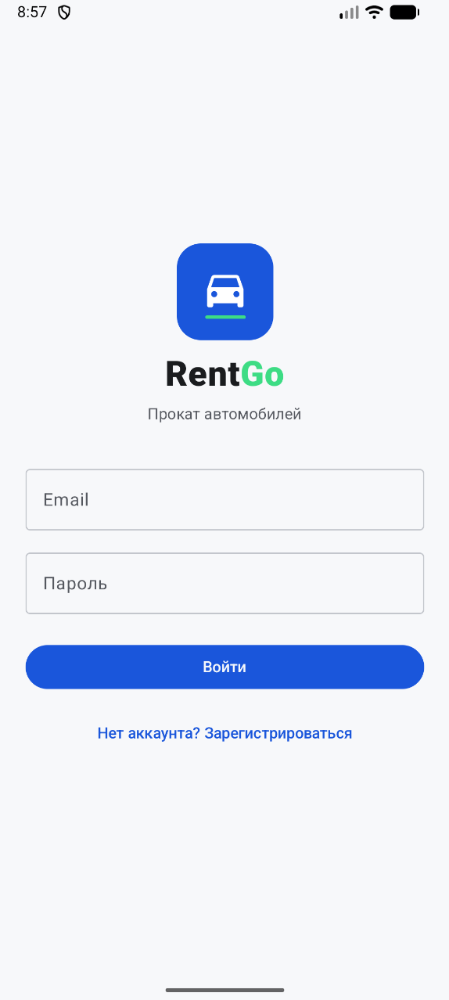
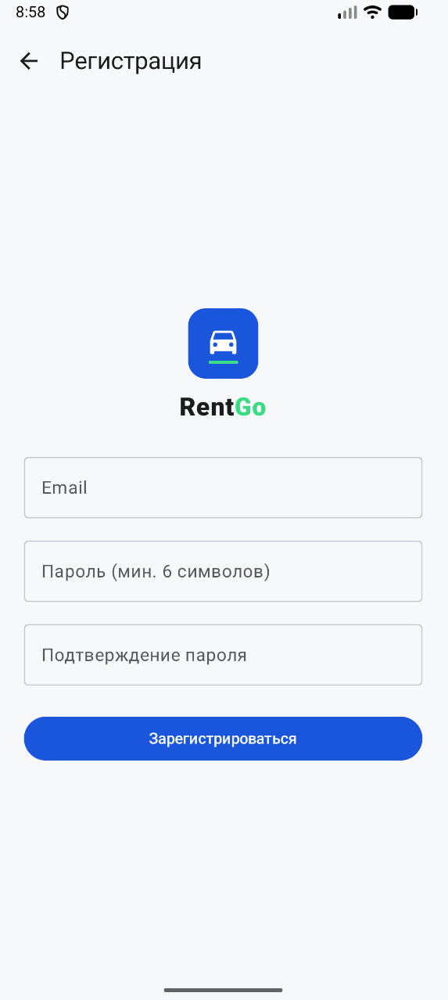
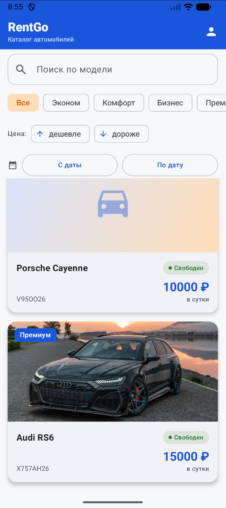
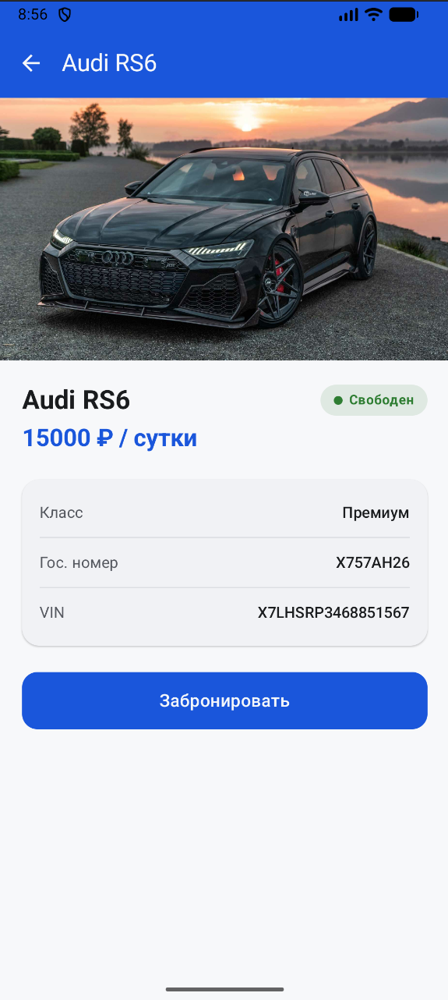
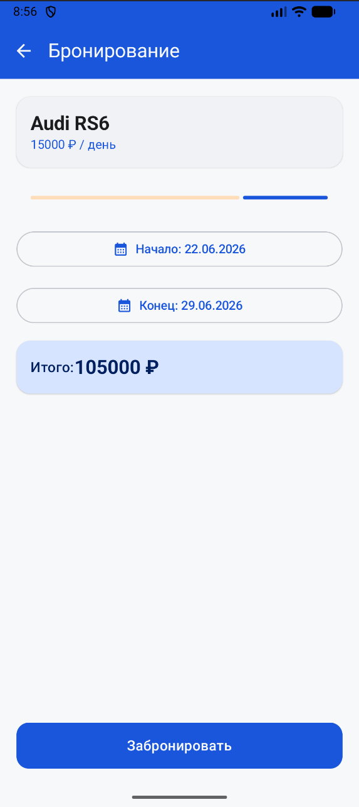
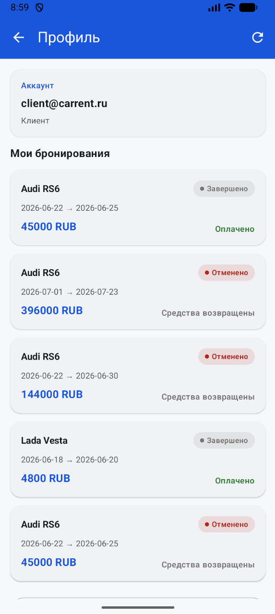
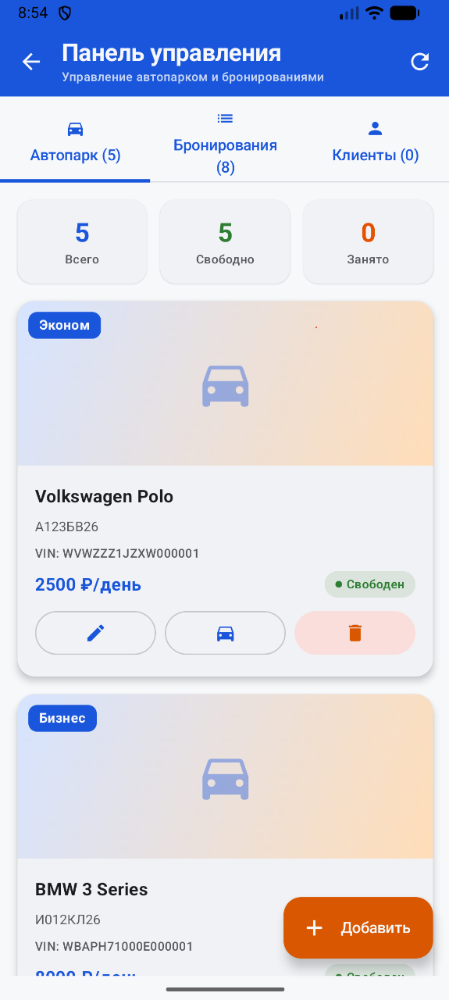
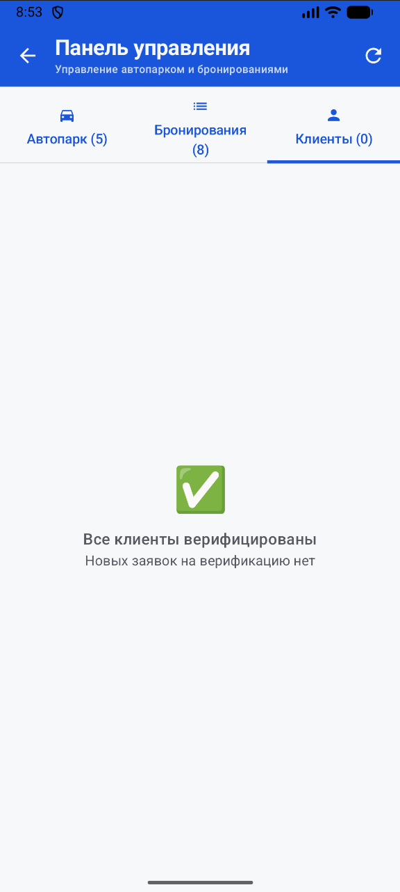
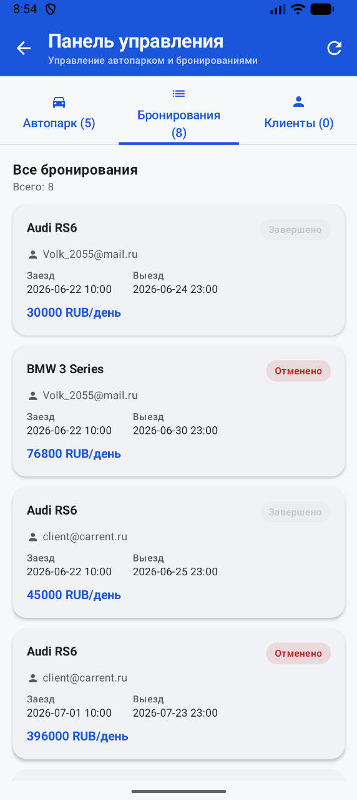

# Этап 8. Пользовательский интерфейс

## Цель этапа

Целью данного этапа является демонстрация пользовательского интерфейса мобильного приложения проката автомобилей посредством скриншотов основных экранов и описания их функционального назначения.

---

## Список экранов

| №   | Экран                            | Описание                                                                       |
| --- | -------------------------------- | ------------------------------------------------------------------------------ |
| 1   | Экран авторизации                | Вход пользователя по адресу электронной почты и паролю                         |
| 2   | Экран регистрации                | Создание новой учетной записи пользователя                                     |
| 3   | Каталог автомобилей              | Просмотр списка доступных автомобилей с возможностью фильтрации                |
| 4   | Карточка автомобиля              | Просмотр характеристик автомобиля, стоимости аренды и информации о доступности |
| 5   | Экран бронирования               | Выбор периода аренды и оформление бронирования автомобиля                      |
| 6   | Мои бронирования                 | Просмотр списка активных и завершённых бронирований пользователя               |
| 7   | Профиль пользователя             | Просмотр персональной информации и выход из системы                            |
| 8   | Панель администратора            | Управление автомобилями, пользователями и бронированиями                       |
| 9   | Список неподтверждённых клиентов | Просмотр пользователей, ожидающих подтверждения документов                     |
| 10  | Выдача и возврат автомобиля      | Регистрация выдачи автомобиля клиенту и оформление его возврата                |

---

## Скриншоты пользовательского интерфейса

### Рисунок 8.1 — Экран авторизации

---

### Рисунок 8.2 — Экран регистрации

---

### Рисунок 8.3 — Каталог автомобилей

---

### Рисунок 8.4 — Карточка автомобиля

---

### Рисунок 8.5 — Экран бронирования

---

### Рисунок 8.6 — Мои бронирования

---

### Рисунок 8.7 — Профиль пользователя

---

### Рисунок 8.8 — Панель администратора

---

### Рисунок 8.9 — Список неподтверждённых клиентов

---

### Рисунок 8.10 — Выдача и возврат автомобиля

---

## Вывод

Разработанный пользовательский интерфейс построен с использованием технологии Jetpack Compose и соответствует архитектуре MVVM. Навигация между экранами обеспечивает последовательное выполнение основных пользовательских сценариев: регистрацию, авторизацию, просмотр каталога автомобилей, оформление бронирования, управление профилем и выполнение административных операций. Взаимодействие с серверной частью осуществляется посредством REST API с использованием библиотеки Retrofit, а локальное кэширование данных реализовано средствами Room.