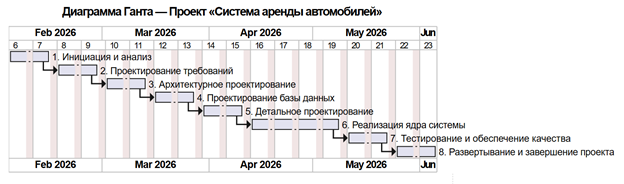

# Этап 12. Управление проектом

## Цель этапа

Целью этапа является организация процесса разработки информационной системы **CarRentalApp**, предназначенной для автоматизации процесса аренды автомобилей. На данном этапе выполняется планирование работ, оценка трудоёмкости разработки, построение календарного плана проекта и анализ возможных рисков.

В результате выполнения этапа определяется последовательность разработки, распределяются основные работы по проекту и формируется основа для контроля выполнения проекта.

---

# Краткое описание проекта

**CarRentalApp** — информационная система проката автомобилей, включающая мобильное Android-приложение и серверную часть на платформе Spring Boot. Система позволяет пользователям регистрироваться, просматривать каталог автомобилей, оформлять бронирования и управлять ими. Для администраторов и менеджеров реализованы функции управления автопарком, бронированиями и подтверждения клиентов.

---

# Основные характеристики проекта

| Параметр | Значение |

|----------|----------|

| Название проекта | CarRentalApp |

| Тип проекта | Информационная система |

| Предметная область | Прокат автомобилей |

| Клиент | Android (Jetpack Compose) |

| Сервер | Spring Boot |

| База данных | PostgreSQL |

| Архитектура | PCMEF |

| Архитектурный стиль | REST |

| Авторизация | JWT |

| ORM | Spring Data JPA (Hibernate) |

| Локальное хранение | Room |

| Контейнеризация | Docker |

| CI/CD | GitHub Actions |

---

# Используемые технологии

## Backend

- Java 21

- Spring Boot

- Spring Security

- Spring Data JPA

- PostgreSQL

- JWT

- Maven

## Android

- Kotlin

- Jetpack Compose

- MVVM

- Retrofit

- Room

- Material 3

## Инструменты разработки

- IntelliJ IDEA

- Android Studio

- Git

- GitHub

- Docker

- Postman

---

# План управления проектом

Разработка проекта выполнялась поэтапно.

Основные этапы реализации:

1. Управление проектом.

2. Анализ требований.

3. Архитектурное проектирование.

4. Проектирование базы данных.

5. Детальное проектирование.

6. Реализация серверной части.

7. Реализация мобильного приложения.

8. Тестирование.

9. Рефакторинг.

10. Документирование REST API.

11. Развёртывание.

12. Подготовка пользовательской документации.

---

# Иерархическая структура работ (WBS)

В рамках проекта была сформирована следующая структура работ:

| Код | Пакет работ | Состав работ |

|------|-------------|--------------|

| 1 | Инициация и анализ | Паспорт проекта, бизнес-анализ, IDEF0, BUC, SWOT-анализ, ROI, анализ предметной области |

| 2 | Проектирование требований | Use Case Diagram, Domain Model, спецификации прецедентов, глоссарий, трассировка требований |

| 3 | Архитектурное проектирование | Архитектура PCMEF, диаграмма пакетов, интерфейсы между слоями, ADR |

| 4 | Проектирование БД | ER-диаграмма, DDL-скрипты, ORM-стратегия, проектирование PostgreSQL |

| 5 | Детальное проектирование | Диаграммы последовательности, диаграмма классов проектирования, применение паттернов GoF |

| 6 | Реализация ядра | Backend (Spring Boot), Android-клиент, REST API, JWT, локальное кэширование |

| 7 | Проверка качества и тестирование | Модульные, интеграционные, системные тесты |

| 8 | Развертывание и завершение проекта | Docker, пользовательская документация, презентация, подготовка к защите |

---

# Календарный план

Продолжительность проекта составляет **18 недель**.

Диаграмма Ганта отражает последовательность выполнения этапов разработки.

---

# Оценка трудоёмкости

Оценка выполнялась по модели **COCOMO Basic**.

Исходные параметры:

- размер проекта — 8 KLOC;

- тип проекта — Organic.

Результаты оценки:

| Показатель | Значение |

|------------|-----------|

| Трудоёмкость | 8,6 чел.-месяцев |

| Продолжительность | 7,7 месяцев |

| Средняя численность команды | 2 человека |

---

# Анализ рисков

| Риск | Вероятность | Воздействие | Меры снижения |

|------|-------------|-------------|---------------|

| Изменение требований | Средняя | Высокое | Регулярное уточнение требований |

| Ошибки бизнес-логики | Средняя | Высокое | Покрытие модульными тестами |

| Сбой базы данных | Низкая | Высокое | Резервное копирование PostgreSQL |

| Ошибки авторизации | Низкая | Высокое | Использование Spring Security и JWT |

| Ошибки интеграции Android и Backend | Средняя | Среднее | Интеграционное тестирование |

---

# Ключевые артефакты этапа

В результате выполнения этапа были разработаны следующие материалы:

- Паспорт проекта;

- Иерархическая структура работ (WBS);

- Диаграмма Ганта;

- Оценка трудоёмкости по модели COCOMO;

- Анализ рисков проекта.

---

# Вывод

Выполнение этапа управления проектом позволило определить структуру разработки, оценить трудоёмкость реализации информационной системы **CarRentalApp**, сформировать календарный план выполнения работ и провести анализ возможных рисков. Полученные результаты стали основой для последующих этапов проектирования, реализации и тестирования программного продукта.